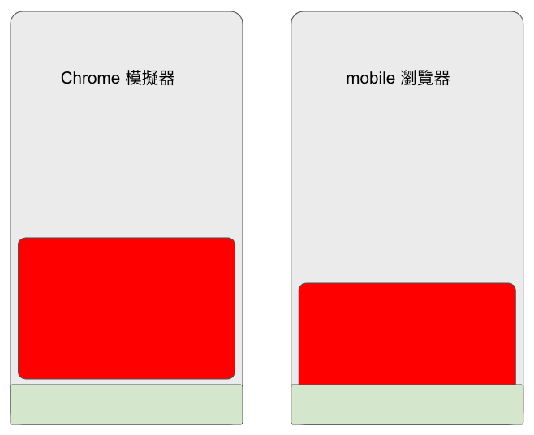

> **參考文章：**
> - [[實作筆記] RWD 設計與 100vh 在行動裝置瀏覽器上的誤區](https://blog.marsen.me/2023/06/15/2023/100vh_problem_with_rwd/ "[實作筆記] RWD 設計與 100vh 在行動裝置瀏覽器上的誤區")

# 前言



我的網頁有作 RWD 的設計，需求大概是這樣，

綠色是在網頁底部懸浮的選單功能，

紅色區塊是一個控制面版，許多的功能、按鈕、連結都設定在上面。

我最一開始的設定方法如下，

```css
height: 100vh;
```

在瀏覽器上使用模擬器顯示正常，但是在手機上就會出現異常

主要是手機上的 Chrome 和 Firefox 瀏覽器通常在頂部有一個 UI（例如導覽列及網址列等）　　
而 Safari 更不同網址列在底部，這使得情況變得更加棘手。

不同的瀏覽器擁有不同大小的視窗，手機會計算瀏覽器視窗為（頂部工具列 + 文件 + 底部工具列）= 100vh。

使用 100vh 將整個文件填充到頁面上時可能導致顯示問題，因為內容可能超出視窗範圍或被遮擋。

因此，在移動設備上進行響應式設計時，應該避免使用 100vh 單位。

# 解決的方法有好幾種，

## JS 計算

使用 JavaScript 監聽事件，動態計算高度，缺點是效能較差，在主流的框架(EX:React)要小心觸發重新渲染的行為

```js
const documentHeight = () => {
 const doc = document.documentElement
 doc.style.setProperty('--doc-height', `${window.innerHeight}px`)
}
window.addEventListener(‘resize’, documentHeight)
documentHeight()
```

## CSS 變數

使用 CSS 變數

```css
:root {
  --doc-height: 100%;
}

html,
body {
  padding: 0;
  margin: 0;
  height: 100vh; /* fallback for Js load */
  height: var(--doc-height);
}
```

## min-height 與 overflow-y

留言有人提到使用min-height 與 overflow-y

但我的情境不適合，而且這個作法會產生捲軸

```css
min-height: 100vh;
```

```css
height: 100vh;
overflow-y: scroll;
```

進一步依照不同的使用情境也許我們需要 @supports

```css
@supports (-moz-appearance: meterbar) {
  /* We're on Mozilla! */
  min-height: calc(100vh - 20px);
}
```

或是 Browser Hacks 的手法

```css
@media screen and (-ms-high-contrast: active), (-ms-high-contrast: none) {
  /* We are on Internet Explorer! */
  min-height: calc(100vh - 10px);
}
```

## position:fixed 的作法

下面的方法可以將元素固定在畫面底部

```css
position: fixed;
left: 0;
right: 0;
bottom: 0;
```

這是我最後選擇的方法，原文的討論相當精彩有趣，

但是我需要的其實是置底，而不是捲軸。

順帶一提我的專是基於 vue 與 tailwindcss，所以下面是 vue 與 tailwindcss 的寫法

```js
<div class="fixed bottom-0 top-0">
  <!--HERE THE FEATURES-->
</div>
```